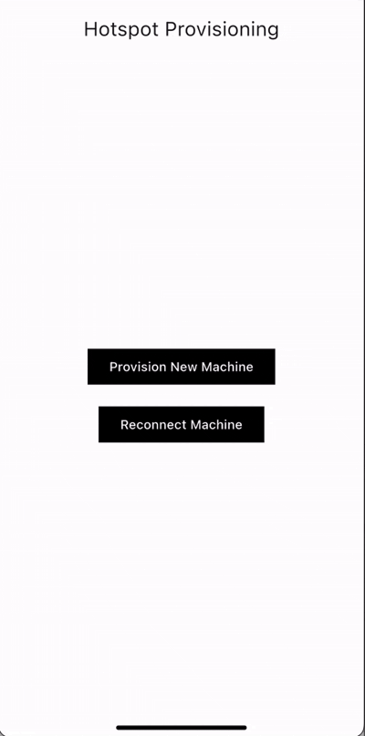
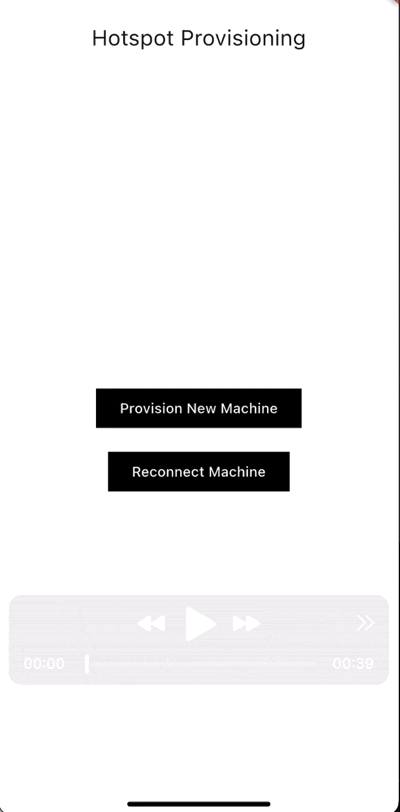

# Viam Flutter Hotspot Provisioning Example

This example project demonstrates how to use the Viam Flutter Hotspot Provisioning Widget to connect robots to the Viam platform. The app showcases two main use cases:

## Use Cases

### 1. Provision a new machine
This flow demonstrates how to connect a **new robot** to the Viam platform for the first time. The process:
- Creates a new robot instance in your Viam organization
- Initiates the hotspot provisioning flow to establish the initial connection
- Guides the user through the connection process

### 2. Reconnect an exisitng machine
This flow demonstrates how to **reconnect an existing robot** to a new wifi network. The process:
- Lists all existing robots in your Viam organization
- Shows their current connection status (online/offline/awaiting setup)
- Allows you to select any robot and initiate the reconnection process
- Uses the same hotspot provisioning flow but with an existing robot instance

## How It Works

Both flows utilize the same underlying `HotspotProvisioningFlow` widget, which:
1. Connects to the robot's hotspot network
2. Configures the robot's network settings  
3. Establishes a connection to the Viam platform
4. Returns the connection status

## Getting Started

1. Ensure you have the required Viam API credentials configured in `lib/consts.dart`
2. Run the example app
3. Choose "Provision New Machine" or "Reconnect Machine"
4. Follow the on-screen instructions

## Previews

